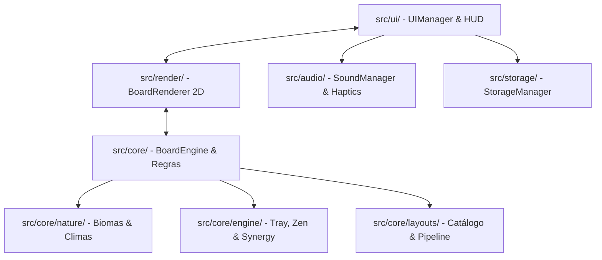

# 🏗️ Diretrizes Técnicas, Arquitetura e Design System

## 1. Mapa de Arquitetura e Módulos do Projeto

O código segue uma **Arquitetura Desacoplada e Orientada a Domínio (DDD leve)**, garantindo que regras de negócio rodem sem dependência de DOM ou Canvas:

### Divisão de Responsabilidades:
* **`src/core/` (Lógica Pura & Matemática):**
  * `BoardEngine.ts`: Estado do tabuleiro, coordenadas tridimensionais (X, Y, Z), detecção de peças bloqueadas/livres e retropropagação de solvabilidade.
  * `src/core/engine/`:
    * `TrayController.ts`: Gerencia o estado da bandeja inferior de peças.
    * `SynergyDirector.ts`: Avaliação e ativação de combos e sinergias de pedras da natureza.
    * `ZenPowerManager.ts`: Gestão de cargas e acionamento de Dicas e Embaralhamentos.
  * `src/core/nature/`: Biomas sazonais (`biomes.ts`), efeitos climáticos (`climates/`) e pedras especiais (`specialTiles/`).
  * `src/core/layouts/`: Mais de 50 layouts cadastrados e gerador de fases verificadas.
* **`src/render/` (Motor Visual Canvas 2D Nativo):**
  * `BoardRenderer.ts`: Orquestrador visual central (renderização sob demanda, viewport, eventos de clique).
  * `TileRenderer.ts`: Desenho individual das peças com texturas de marfim, chanfros 2.5D e glifos.
  * `ViewportCamera.ts`: Controle de pan, zoom e encaixe adaptativo da prancha na tela.
  * `FXParticleSystem.ts`: Partículas leves desenhadas diretamente no canvas via delta-time.
  * `SynergyAnimator.ts` & `BoardAnimator.ts`: Coreografia de animações de match e efeitos de sinergia.
* **`src/ui/` (Interface do Usuário & HUD):**
  * `UIManager.ts`: Controlador mestre de telas, modais de vitória/derrota e transições.
  * `HUDController.ts`: Painel de controle superior e inferior com botões ergonômicos de polegar (48px+).
  * `TrayAnimator.ts`: Animações CSS coordenadas da bandeja de peças.
* **`src/audio/`:** `SoundManager.ts` (Web Audio API procedural) e `HapticManager.ts` (`@capacitor/haptics`).
* **`src/storage/`:** `StorageManager.ts` (Persistência estrita em `localStorage` com fallback seguro).

---

## 2. Tipagem e Boas Práticas (TypeScript Strict)
- **TypeScript Strict**: Proibido o uso de `any`. Tipagem explícita com interfaces estritas (`PlacedTile`, `TileType`, `Suit`, `Coordinates`, `BoardState`, `SynergyResult`).
- **Comunicação por Callbacks Tipados**: A comunicação entre a engine visual (`BoardRenderer`) e a UI ocorre exclusivamente através da interface `BoardRendererCallbacks` (`onTileClick`, `onMatchSuccess`, `onTileFlightToTray`, `onCosmicRescue`, `onStateChanged`).
- **Sem Loops Contínuos Ociosos**: Nunca instanciar `requestAnimationFrame` sem fim no Canvas. Toda renderização deve seguir o padrão *Dirty Flag* (`requestRender()`).

---

## 3. Design System Tokens (CSS)
- **Cores da Mesa (Feltro & Madeira):**
  - Feltro Verde Clássico: `#153E2A`
  - Madeira Mogno: `#2C1810`
  - Jardim Zen Dark: `#12161A`
- **Cores das Peças:**
  - Face da Pedra: `#FDFBF7` (Marfim acetinado de alto contraste)
  - Chanfro Lateral 2.5D: `#1E3F20` (Jade) / `#3A2312` (Madeira)
  - Sombra Z: `rgba(0, 0, 0, 0.35)`
  - Destaque Selecionada: `#F59E0B` (Âmbar/Dourado)
  - Dica Ativa (Hint): `#10B981` (Verde Esmeralda pulsante)
- **Tipografia & Legibilidade:**
  - Numerais arábicos auxiliares nítidos em todas as pedras para facilitar o reconhecimento visual sênior.
  - Alvos de toque nunca inferiores a **48×48px**.

