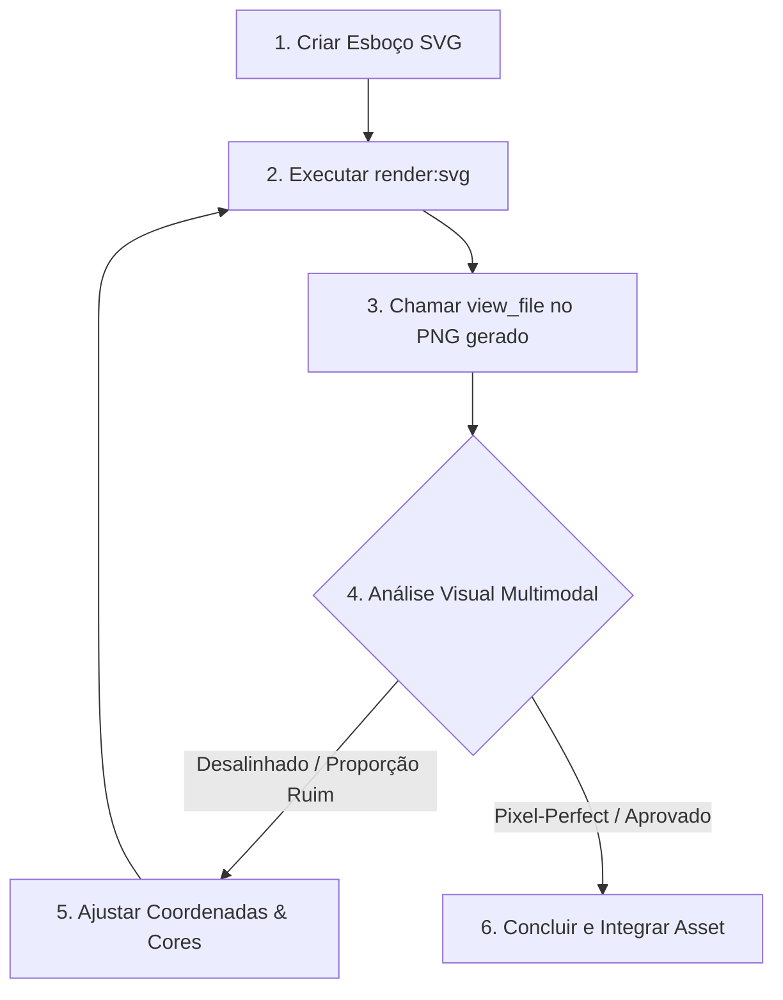

# 🎨 SVG Drawing & Visual Feedback Skill

Esta skill fornece uma metodologia rigorosa de design vetorial iterativo com **inspeção visual em tempo real**, evitando "desenhar às cegas" em coordenadas SVG.

---

## 🎯 Quando Usar
- Criação de novos ícones ou símbolos de interface (HUD, botões, modais).
- Criação e refinamento de glifos, naipes e peças visuais do jogo (Mahjong tiles, flores, dragões).
- Ajustes finos de proporção, curvas Bézier, alinhamentos e contraste de cores em arquivos `.svg`.

---

## 🛠️ Ferramenta Local: `render:svg`

O projeto conta com um renderizador vetorial nativo via Node.js (`@resvg/resvg-js`), 100% compatível com Windows/PowerShell.

### Comandos:
```bash
# Renderiza para PNG com o mesmo nome e diretório
npm run render:svg src/assets/icons/hint.svg

# Renderiza com nome/caminho customizado
npm run render:svg src/assets/icons/hint.svg scratch/hint-preview.png

# Renderiza forçando uma largura específica em pixels (escala nítida)
npm run render:svg src/assets/icons/hint.svg scratch/hint-512px.png 512
```

---

## 🔄 Fluxo de Trabalho Iterativo (O Loop de Visão)



### Passo 1: Estruturar as Formas Básicas
Comece com a geometria primária (`viewBox`, retângulos, círculos ou paths principais), definindo claramente as dimensões:
```xml
<svg xmlns="http://www.w3.org/2000/svg" viewBox="0 0 128 128" width="128" height="128">
  <!-- Camada de fundo / base -->
  <!-- Formas centrais -->
</svg>
```

### Passo 2: Renderizar Imediatamente
Gere o PNG para inspeção:
```bash
npm run render:svg caminho/para/asset.svg
```

### Passo 3: Inspecionar com `view_file`
Chame a ferramenta nativa `view_file` no caminho do `.png` gerado:
> O modelo possui capacidade de visão computacional multimodal e avaliará o arquivo de imagem renderizado exatamente como o usuário o verá.

### Passo 4: Refinar e Polir
Identifique discrepâncias visuais:
- **Espessura de traço (`stroke-width`)**: Ficou muito fino em telas mobile de alta densidade?
- **Alinhamento & Centralização**: O glifo está perfeitamente centrado no `viewBox`?
- **Contraste**: A legibilidade está de acordo com as regras de acessibilidade para idosos/jogadores casuais?
- **Bézier Curves**: Os pontos de controle do `d="M ... C ... Z"` estão suaves ou facetados?

Edite o SVG e repita os passos 2 e 3 até atingir a excelência estética.

---

## 💡 Diretrizes de Qualidade para Assets Vetoriais

1. **viewBox Padronizado**: Use sempre caixas canônicas (`0 0 48 48` para botões de HUD/ação mobile, `0 0 128 160` para pedras de jogo).
2. **Camadas Ordenadas**: 
   - Fundo/sombreamento primeiro.
   - Corpo principal no meio.
   - Destaques de luz (*highlights*) e glifos por cima.
3. **Escalabilidade Nítida**: Evite números decimais excessivos gerados por softwares terceiros que poluam o arquivo; prefira vetores matematicamente limpos e organizados.
4. **Pronto para Animação**: Se o elemento for animado por código, configure `pathLength="1"` e consulte a skill complementar [`.agent/skills/svg-animations/`](file:///d:/Este%20Computador/Documentos/gihub/mahjong/.agent/skills/svg-animations/SKILL.md).

---

## 📐 Sistema de Ícones Padronizado (Icon System Rules)

Para garantir que todos os botões e ícones do jogo pertençam à mesma família visual coesa:

### 1. Grade Canônica & Zona de Segurança (Safe Zone)
* Todo ícone de ação mobile usa `viewBox="0 0 48 48"`.
* **Margem de segurança obrigatória:** Mantenha um respiro de 4px em todas as bordas (a geometria ativa deve viver dentro do retângulo `x: 4..44, y: 4..44`), evitando cortes de traço nas bordas da tela.

### 2. Especificação Única de Traço (Uniform Stroke)
* **Espessura padrão:** `stroke-width="2.5"` (garante nitidez perfeita e alta legibilidade para idosos em telas mobile de alta densidade).
* **Terminações:** Sempre utilize `stroke-linecap="round"` e `stroke-linejoin="round"`.
* **Cores Semânticas:** Utilize `stroke="currentColor"` ou `fill="currentColor"` nos ícones para herdarem automaticamente a cor de texto/tema do botão pai (modo escuro, dourado ativo ou marfim).

### 3. Equilíbrio Óptico (Optical Weight)
* **Formas Circulares:** Devem medir ~38x38px no grid de 48px.
* **Formas Quadradas/Retangulares:** Devem medir ~34x34px para compensar a maior área sólida e parecerem do mesmo tamanho óptico que os círculos.

---

## 🧮 Geração Paramétrica de Curvas Matemáticas (Scripts Utilitários)

Para formas geométricas complexas (espirais, arcos de círculo precisos, ondas senoidais, parábolas e interpolações spline/bézier), a skill conta com geradores matemáticos em Python para evitar adivinhação de coordenadas manuais:

### 1. `svg-path.py` (Gerador Paramétrico)
Calcula a sequência exata de comandos `d="..."` para equações geométricas:
```bash
# Arco circular exato (ex: arcos de portas, leques, botões circulares)
python .agent/skills/svg-drawing/scripts/svg-path.py arc --params '{"start_x": 12, "start_y": 36, "end_x": 36, "end_y": 36, "radius": 14, "sweep": 1}'

# Curva em S suave (para caules de flores, ondas, dragões)
python .agent/skills/svg-drawing/scripts/svg-path.py s_curve --params '{"start_x": 10, "start_y": 40, "end_x": 38, "end_y": 10, "curvature": 0.4}'

# Curva Bézier cúbica com pontos de controle
python .agent/skills/svg-drawing/scripts/svg-path.py bezier --params '{"start_x": 10, "start_y": 35, "cp1_x": 15, "cp1_y": 15, "cp2_x": 33, "cp2_y": 15, "end_x": 38, "end_y": 35}'

# Espiral paramétrica
python .agent/skills/svg-drawing/scripts/svg-path.py spiral --params '{"center_x": 24, "center_y": 24, "max_radius": 18, "revolutions": 3}'
```

*Consulte todos os parâmetros e equações disponíveis em [paths_guidelines.md](file:///d:/Este%20Computador/Documentos/gihub/mahjong/.agent/skills/svg-drawing/references/paths_guidelines.md).*

### 2. `merge-paths.py` (União de Múltiplos Segmentos)
Concatena múltiplos trechos contínuos de caminhos removendo comandos `M/m` intermediários:
```bash
python .agent/skills/svg-drawing/scripts/merge-paths.py --paths '["M 10 30 Q 20 10 30 30", "M 30 30 L 40 20"]'
# Saída: M 10 30 Q 20 10 30 30 L 40 20
```

### 3. Marcadores de Ponta de Seta
Para flechas de tutorial, guias de toque e indicações de fluxo, consulte [arrow-guidelines.md](file:///d:/Este%20Computador/Documentos/gihub/mahjong/.agent/skills/svg-drawing/references/arrow-guidelines.md).


