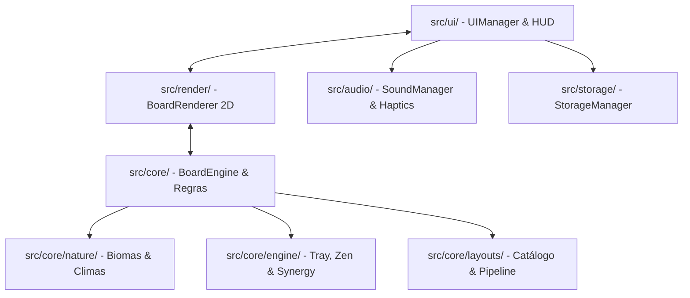

# 🀄 Mahjong Solitaire Offline para Android

[](https://www.typescriptlang.org/)
[](https://vitejs.dev/)
[](https://capacitorjs.com/)
[](https://developer.mozilla.org/en-US/docs/Web/API/Canvas_API)
[](#)
[](#)

Jogo de **Mahjong Solitaire (Shanghai / Taipei)** 100% offline, desenvolvido com carinho especialmente para jogabilidade relaxante, fluida e acessível em dispositivos Android.

O produto combina a tradição milenar das pedras de Mahjong com mecânicas autorais de **Biomas, Climas da Natureza, Sinergias Elementares e Bandeja Zen**, com foco extremo em usabilidade, ergonomia tátil e acessibilidade para pessoas da terceira idade e jogadores casuais.

---

> 📖 **Documentação Canônica Completa:**  
> Consulte o [**Compêndio Oficial de Design & Engenharia (Bíblia de Jogo)**](./docs/compendium/README.md) para a especificação exaustiva das mecânicas, catálogo das **157 Peças**, matriz de **211 Sinergias** e atlas das **50 Fases Oficiais**.

---

## 🌟 Principais Recursos & Filosofia Zen

### 👵 Acessibilidade Suprema & Ergonomia Mobile
- **Legibilidade Máxima:** Numerais arábicos sutis de auxílio (1 a 9) impressos no canto superior das pedras de Caracteres, Flores e Ventos, permitindo identificação imediata.
- **Peças Grandes com Auto-Fit:** Cálculo inteligente de escala e viewport que aproveita ao máximo a tela do celular/tablet (orientação paisagem) sem cortes e com suporte nativo a High-DPI / Retina (DPR até 3.0).
- **Destaque Visual de Peças Livres:** Peças bloqueadas recebem um filtro translúcido suave, destacando instantaneamente as peças livres para jogada.
- **Ergonomia do Polegar:** Botões inferiores ampliados para toque com área de toque mínima de **48×48px** (norma WCAG/Material Design).
- **Zero Punição:** Sem cronômetros regressivos estressantes, sem vidas, sem telas de game over punitivas e com anúncios zero (experiência 100% offline).

### 🌿 Mecânicas da Natureza & Elementos Especiais
- **10 Mundos & 50 Pranchas Progressivas:** Progressão de 36 a 144 peças com estágios multi-wave e garantia matemática de vitória em 100% das partidas geradas.
- **Biomas Elementares:** Cinco biomas temáticos (Jardim Zen, Bosque Encantado, Vale Glacial, Rios Ancestrais e Savana) com regras sazonais e trilha atmosférica.
- **Climas Ativos:** Efeitos climáticos dinâmicos que alteram o tabuleiro de forma benéfica:
  - 🌊 *Maré Alta Purificadora:* Lava a bandeja e elimina pares livres.
  - ☀️ *Onda de Calor:* Derrete pedras de gelo e transmuta camaleões.
  - ❄️ *Nevasca Ártica:* Pausa temporizadores e concede jogada livre.
  - 🍂 *Vendaval de Outono:* Corta vinhas e reorganiza peças bloqueadas.
  - ⚡ *Tempestade Zen:* Raio vaporiza obstáculos e recarrega a Marreta.
- **Peças Especiais Únicas:**
  - 🦎 **Camaleão:** Transmuta sua face para espelhar a pedra combinada, preservando a bijeção e a solvabilidade matemática.
  - 🎁 **Baú da Fortuna:** Combinação premiada que recarrega ferramentas zen (Dica, Marreta ou Embaralhar).
  - 🧊 **Pedras de Gelo:** Congeladas no tabuleiro que derretem com o calor ou combinações adjacentes.
  - 🌿 **Cipós e Vinhas:** Prendem pedras até serem cortados pelo vento ou liberados.
  - 🥚 **Casulos Místicos:** Chocam durante a partida, liberando animais sagrados e pontuação de harmonia.
- **Sinergias & Famílias:** Bônus de harmonia ao combinar animais e alimentos/elementos associados (ex: Macaco + Banana, Abelha + Colmeia, Esquilo + Noz).
- **Bandeja Zen (Tray Controller):** Reserva tátil inferior onde pedras estratégicas podem descansar temporariamente, contando com animações fluidas de voo e desfecho reversível (*undo* com voo reverso).
- **Recursos Zen Gratuitos:**
  - ↩️ **Desfazer (Undo)** ilimitado passo a passo.
  - 💡 **Dicas (Hint)** inteligentes com pulso esmeralda no par livre ótimo.
  - 🔀 **Embaralhar (Shuffle)** garantindo novas jogadas sem perder o progresso.
  - 🔨 **Marreta Zen:** Remove pares complexos sem punição.
  - ✨ **Resgate Cósmico (Cosmic Rescue):** Algoritmo de segurança que previne deadlocks caso o jogador fique sem opções.

### 🔋 Otimização Energética & Motor Visual
- **Render-on-Demand (Dirty Flag):** Desenho no HTML5 Canvas 2D nativo apenas quando há interação, transição ou animação — **0% de consumo de CPU/GPU em repouso**.
- **Suspensão em Segundo Plano (Background Pause):** Ao minimizar o aplicativo no Android, os tickers de animação, temporizadores e sintetizadores de áudio são pausados instantaneamente.
- **Áudio Procedural & Haptics:** Efeitos sonoros autênticos de toque de marfim (*clack*), vento e água sintetizados via Web Audio API localmente e feedback tátil sutil via `@capacitor/haptics`.

---

## 🗺️ Progressão de Mundos (50 Fases)

| Mundo | Título | Fases | Bioma | Destaque / Mecânica Introduzida |
| :--- | :--- | :---: | :--- | :--- |
| **Mundo 1** | *Jardim do Aprendiz* | 1 – 5 | Jardim Zen | Introdução suave, tabuleiros abertos e pares elementares |
| **Mundo 2** | *Bosque da Fortuna* | 6 – 10 | Floresta | O Camaleão Dourado e os Baús da Fortuna premiados |
| **Mundo 3** | *Vale Glacial* | 11 – 15 | Ártico | Águas geladas, auroras boreais e peças de Gelo |
| **Mundo 4** | *Floresta de Bambu* | 16 – 20 | Floresta | Santuário do Panda Zen e cipós/vinhas |
| **Mundo 5** | *Santuário de Pedra* | 21 – 25 | Savana/Terra | Megálitos ancestrais, rochas e casulos místicos |
| **Mundo 6** | *Rios Ancestrais* | 26 – 30 | Água | Pontes pênseis sobre águas e Maré Alta Purificadora |
| **Mundo 7** | *Reino dos Espelhos* | 31 – 35 | Místico | Salões de mármore imperial e peças de Espelho |
| **Mundo 8** | *Savana dos Segredos* | 36 – 40 | Savana | Grandes predadores, calor intenso e Chave Mestra |
| **Mundo 9** | *Cumes Celestiais* | 41 – 45 | Montanha | Montanhas sagradas, Tempestade Zen e Dragão Vermelho |
| **Mundo 10** | *Templo dos Mestres* | 46 – 50 | Sagrado | O desafio supremo: Shanghai Clássico com 144 peças |

---

## 🏗️ Arquitetura do Projeto

O código foi projetado seguindo uma **Arquitetura Desacoplada e Orientada a Domínio (DDD leve)**, garantindo que as regras matemáticas do Mahjong rodem de forma pura e independente de Canvas ou DOM:



### Principais Módulos:
- [`src/core/BoardEngine.ts`](file:///d:/Este%20Computador/Documentos/gihub/mahjong/src/core/BoardEngine.ts): Estado das pedras, coordenadas 3D (X, Y, Z), detecção de bloqueio e retropropagação de solvabilidade matemática.
- [`src/core/nature/`](file:///d:/Este%20Computador/Documentos/gihub/mahjong/src/core/nature/): Gerenciamento de biomas, climas atmosféricos e regras de peças especiais ([`SpecialTileRules.ts`](file:///d:/Este%20Computador/Documentos/gihub/mahjong/src/core/nature/specialTiles/SpecialTileRules.ts)).
- [`src/core/engine/`](file:///d:/Este%20Computador/Documentos/gihub/mahjong/src/core/engine/): Controladores da Bandeja Zen ([`TrayController.ts`](file:///d:/Este%20Computador/Documentos/gihub/mahjong/src/core/engine/TrayController.ts)), Poderes Zen e Diretor de Sinergias.
- [`src/render/BoardRenderer.ts`](file:///d:/Este%20Computador/Documentos/gihub/mahjong/src/render/BoardRenderer.ts): Engine gráfica em Canvas 2D puro nativo com renderização *render-on-demand*, sombreamento 2.5D, chanfros de marfim/jade e sistema leve de partículas.
- [`src/ui/UIManager.ts`](file:///d:/Este%20Computador/Documentos/gihub/mahjong/src/ui/UIManager.ts): Gerenciador da interface com painel HUD ergonômico, modais de vitória/derrota com redesign estético e seleção de mundos.
- [`src/storage/StorageManager.ts`](file:///d:/Este%20Computador/Documentos/gihub/mahjong/src/storage/StorageManager.ts): Persistência 100% offline de progresso, estrelas obtidas, pontuações e configurações.

---

## 🧪 Suíte de Testes & Validação Automática

O projeto conta com ferramentas de verificação estática, solvabilidade e validação de Level Design:

| Comando | Descrição |
| :--- | :--- |
| `npm run test` | Executa a bateria completa de testes automatizados do ecossistema. |
| `npm run test:zen` | Valida cenários de jogabilidade zen, undo, dicas e resgate cósmico. |
| `npm run validate:levels` | Valida solvabilidade matemática e consistência de todas as 50 pranchas. |
| `npm run test:curation` | Testa o pipeline de curadoria de baralhos e distribuição de animais. |
| `npm run report:levels` | Gera relatório aprofundado dos 10 itens canônicos de Level Design. |
| `npm run graphcode:audit`| Realiza auditoria estática da árvore de dependências e integridade modular. |
| `npm run render:svg` | Renderiza vetores SVG para PNG via Node.js para inspeção visual multimodal. |

---

## 💻 Como Rodar no Computador (Desenvolvimento Local)

### Pré-requisitos
- **Node.js:** Versão 18+ (recomendado Node.js 20 LTS ou superior)
- **NPM:** Gerenciador de pacotes padrão

### Passo a Passo
```bash
# 1. Instalar as dependências do projeto
npm install

# 2. Iniciar o servidor de desenvolvimento local
npm run dev
```

Abra a URL indicada no terminal (por padrão: `http://localhost:3000`).
> **Dica de Teste:** Pressione `F12` no navegador (Chrome, Edge ou Firefox), ative a emulação de dispositivos móveis (ex: Galaxy S20 / iPad) e gire para o modo **Horizontal / Paisagem** para experimentar a ergonomia tátil original.

---

## 📱 Como Gerar o APK / AAB para Android

O jogo utiliza o **Capacitor 6** para empacotar o código web em uma aplicação Android nativa de alto desempenho.

### 1. Compilar o Projeto Web e Sincronizar com o Android
```bash
npm run build
npx cap sync android
```

### 2. Gerar o APK de Depuração (Debug APK)
Execute via linha de comando (Windows PowerShell):
```powershell
cd android
.\gradlew assembleDebug
```
*O arquivo `.apk` compilado estará em:*
```text
android/app/build/outputs/apk/debug/app-debug.apk
```

### 3. Gerar o Pacote de Produção (Android App Bundle - AAB)
Para distribuição na Google Play Store:
```powershell
cd android
.\gradlew bundleRelease
```

### 4. Instalação Direta no Celular (Sideloading)
1. Conecte o celular ao computador via cabo USB (ou envie o arquivo `app-debug.apk` via WhatsApp/Telegram/Drive).
2. No celular Android, toque no arquivo `.apk` baixado.
3. Se o sistema solicitar autorização para instalação de fontes desconhecidas, selecione **"Permitir desta fonte"**.
4. Conclua a instalação tocando em **Instalar**. O ícone do jogo aparecerá na tela inicial e poderá ser jogado sem qualquer conexão com a internet.

---

## 🔄 Atualizações Locais OTA (Live Update)

O jogo possui integração com o `@capawesome/capacitor-live-update` através do [`LiveUpdateManager.ts`](file:///d:/Este%20Computador/Documentos/gihub/mahjong/src/core/LiveUpdateManager.ts).
- O bundle original embutido no APK é carregado instantaneamente (Zero Loading Screen).
- Permite aplicar correções de layout e novos catálogos de fases localmente sem necessidade de reinstalar o aplicativo.

---

## 📄 Licença e Uso

Desenvolvido para entretenimento pessoal e familiar com foco no bem-estar, relaxamento cognitivo e acessibilidade sênior. 🌸🀄
