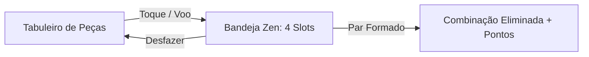

# 📜 Volume I: Manual de Mecânicas & Regras Zen

> **Bíblia de Game Design & Arquitetura de Regras do Mahjong Solitaire Offline**  
> Documento Canônico de Referência para Engenharia e Game Design.

---

## 🏛️ 1. Filosofia Central de Design (O Padrão Zen)

O **Mahjong Solitaire Offline** une o clássico jogo ancestral de Shanghai com mecânicas ecológicas contemporâneas. A experiência é regida por 4 pilares inegociáveis:

1. **Acessibilidade Sênior Extrema:** Alvos de toque nunca inferiores a 48×48px, contraste visual WCAG AAA (>7:1), numerais arábicos sutis de auxílio nas pedras e feedback multimodal triplo (visual, clique sonoro de marfim e haptic feedback).
2. **Zero Punição:** Sem cronômetros punitivos (sem Game Over por tempo), Desfazer ilimitado e Dicas gratuitas que nunca reduzem pontuação ou estrelas.
3. **Solvabilidade Matemática Absoluta:** 100% dos tabuleiros gerados são solúveis, garantidos por um pipeline de geração e retropropagação matemática.
4. **Eficiência Mobile Offline:** Zero chamadas de API de rede, renderização sob demanda (*dirty flag*) com 0% de CPU/GPU em repouso e 60 FPS consistentes.

---

## 🀄 2. Fundamentos do Tabuleiro & Regras Clássicas

### Coordenadas Tridimensionais (X, Y, Z)
Cada peça ocupa uma posição tridimensional na prancha:
* **X e Y:** Coordenadas de grade espacial na mesa.
* **Z (Camada):** Altura da peça no empilhamento (Camada 0 é a base; camadas superiores até Z=5 formam pirâmides, torres e megálitos).

### Critérios de Peça Livre (*Free Tile*)
Uma peça só pode ser selecionada pelo jogador se cumprir **duas condições simultâneas**:
1. **Desobstrução Superior (Eixo Z):** Nenhuma outra peça pode estar sobreposta (total ou parcialmente) na camada imediatamente acima ($Z + 1$).
2. **Desobstrução Lateral (Eixo X):** O lado esquerdo **OU** o lado direito da peça deve estar completamente livre de vizinhos na mesma camada $Z$.

---

## 📥 3. A Bandeja Zen (Mecânica Central de 4 Slots)

A **Bandeja Zen** (*Tray Bar*) é uma mecânica tátil de reserva de peças localizada na faixa inferior da tela, contendo **4 slots**:

### Dinâmica da Bandeja:
1. **Voo da Peça (`onTileFlightToTray`):** Ao tocar em uma peça livre no tabuleiro, ela não exige encontrar o par imediatamente. Ela voa animadamente para o primeiro slot livre da bandeja.
2. **Formação de Par na Bandeja:**
   * Se o jogador colocar uma peça na bandeja e, posteriormente, tocar no par correspondente no tabuleiro, a combinação é liquidada imediatamente.
   * Se duas peças idênticas já estiverem na bandeja, elas se fundem e são eliminadas, liberando os 2 slots ocupados.
3. **Resgate Cósmico (`Cosmic Rescue`):**
   * Se todas as peças do tabuleiro forem eliminadas e restar **1 peça órfã solitária** na bandeja (decorrente de transmutação, predador ou combinação ímpar prévia), o jogo aciona automaticamente o *Resgate Cósmico*. Uma aura dourada envolve a peça, eliminando-a com bônus celestial e concedendo a vitória à partida.
4. **Caminho Obstruído (`Deadlock`):**
   * Se os 4 slots da bandeja forem preenchidos e não houver nenhuma peça livre no tabuleiro que combine com as peças da bandeja, o estado de *Caminho Obstruído* é detectado pelo `TrayTacticalOracle`, oferecendo ao jogador as opções de Desfazer (Undo) ou Embaralhar (Shuffle).

---

## ✨ 4. Mecânicas Especiais & Ecológicas

### 1. Trinca Sagrada Zen (`Sacred Trio`)
* Quando 3 peças idênticas de uma espécie mística ou sagrada se encontram na bandeja, uma harmonia tríplice é disparada.
* **Efeito:** Eliminação instantânea das 3 peças com bônus de **+500 pontos** de Harmonia e explosão de partículas douradas.

### 2. Predação Selvagem (`Wild Predation`)
* Mecânica que simula a cadeia alimentar natural diretamente nos slots da bandeja.
* **Comportamento:** Quando um **Predador de Topo** (ex: 🦁 Leão, 🦅 Águia, 🐺 Lobo) entra na bandeja enquanto uma **Presa Natural** (ex: 🐰 Coelho, 🐟 Peixinho, 🐁 Esquilo) já está ocupando um slot:
  * O predador consome a presa.
  * A presa é removida da bandeja, **liberando um slot**.
  * É concedido um **Bônus Selvagem de +300 pontos**.
  * O predador permanece na bandeja aguardando seu próprio par.
  * O sistema de **Desfazer (Undo)** ressuscita a presa e restaura o tabuleiro perfeitamente.

### 3. Camaleão Místico (`Universal Wildcard`)
* O 🦎 **Camaleão** é o curinga universal do jogo.
* **Compatibilidade:** Combina bidirecionalmente com **qualquer uma das 157 entidades** do catálogo (animais, flora, elementos ou míticos).
* Ao ser pareado com qualquer peça, o Camaleão assume sua essência e liberta o par.

### 4. Ninho e Casulo Multi-Hit (`Multi-Hit Cocoon`)
* Estrutura blindada que protege uma espécie rara.
* **Mecânica de Eclosão:** O casulo não pode ser pareado diretamente. Ele requer **2 impactos adjacentes** (matches realizados em peças imediatamente vizinhas).
  * 1º Impacto: O casulo racha visualmente e emite faíscas.
  * 2º Impacto: O casulo se estilhaça e transmuta instantaneamente na criatura mística que guardava em seu interior (ex: Camaleão ou Borboleta Imperial).

### 5. Névoa dos Picos & Selos Rúnicos Elementais
* **Névoa dos Picos:** Peças cobertas por névoa densa. Ao combinar uma peça adjacente, o vento do match dissipa a névoa, revelando a face oculta.
* **Selos Elementais (Cúpulas Rúnicas):** Peças envoltas por uma barreira elementar (Fogo, Gelo, Trovão, Vento) que impede sua seleção. Ao encontrar e combinar o **Par-Chave** do elemento correspondente na mesa, todos os selos daquele elemento se estilhaçam com bônus de **+200 pontos**.

### 6. Ciclo Dia & Noite (Solar e Lunar)
* A cada 8 combinações de pares, o ambiente transita suavemente entre o **Dia** (Sol) e a **Noite** (Luar).
* **Bônus Solar (+150 pts):** Concedido quando espécies diurnas (Águias, Cavalos, Borboletas, Girassóis) são combinadas sob a luz do Sol.
* **Bônus Lunar (+150 pts):** Concedido quando espécies noturnas (Corujas, Lobos, Morcegos, Vagalumes) são combinadas sob a luz da Lua.

---

## 🧰 5. Arsenal de Poderes Zen (Ferramentas)

| Ferramenta | Ícone | Função | Regra de Penalidade |
| :--- | :---: | :--- | :--- |
| **Desfazer** | ↩️ | Reverte a última jogada com 100% de integridade (desfaz voos, matches, predações e restaura pontuação). | **Ilimitado e Gratuito** |
| **Dica Zen** | 💡 | Ilumina com aura pulsante de esmeralda/âmbar o par livre mais estratégico da mesa. | **Gratuito (Zero perda de estrelas)** |
| **Embaralhar** | 🔀 | Redistribui as peças restantes mantendo comprovadamente a solvabilidade matemática. | **Gratuito (Sem Game Over)** |
| **Marreta Zen** | 🔨 | Destrói uma peça isolada ou obstáculo bloqueador específico no tabuleiro. | **3 Cargas Iniciais por Partida** |

---

## ⭐ 6. Sistema de Avaliação Zen (1 a 3 Estrelas)

O critério de estrelas premia a serenidade e a exploração de combos da natureza sem jamais punir o jogador casual:

* ⭐ **1 Estrela (Conclusão Básica):** Concedida ao limpar todas as peças do tabuleiro e esvaziar a bandeja.
* ⭐⭐ **2 Estrelas (Harmonia Natural):** Concedida ao poupar ferramentas de auxílio (sem usar Marreta/Embaralhar) **OU** ativar pelo menos 2 sinergias ecológicas na partida.
* ⭐⭐⭐ **3 Estrelas (Zen Máximo):** Concedida ao poupar ferramentas de auxílio **E** ativar pelo menos 2 sinergias ecológicas, demonstrando domínio e serenidade total.
