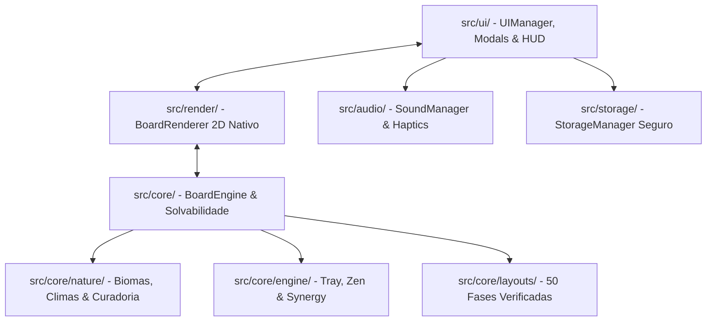

# 🀄 Compêndio Oficial do Mahjong Solitaire Offline

> **Bíblia de Game Design, Bestiário de Fauna, Atlas de Mundos e Arquitetura de Software**  
> Edição Canônica Unificada — Mahjong Solitaire Zen Offline v1.0.1.

---

## 📚 Estrutura da Enciclopédia

Esta documentação consolida 100% dos aspectos do jogo em três volumes detalhados:

* 📘 **[Volume I: Manual de Mecânicas & Regras Zen](./01_MECANICAS_E_REGRAS.md)**
  * Solvabilidade garantida por retropropagação matemática.
  * Mecânica tátil da Bandeja Zen (4 slots), Resgate Cósmico e Deadlock.
  * Efeitos especiais: Trinca Sagrada, Predação Selvagem, Camaleão Curinga, Ninhos Multi-Hit, Névoa dos Picos e Selos Elementais.
  * Ciclos Dia & Noite, Arsenal de Ferramentas Zen e Sistema 3★.

* 🐾 **[Volume II: Bestiário & Catálogo Oficial de Peças](./02_CATALOGO_PECAS_FAUNA.md)**
  * As 157 entidades da natureza divididas em 10 Tiers ecológicos.
  * Matriz das 211 conexões de sinergias da natureza.
  * Atributos visuais, numerais de acessibilidade sênior, VFX de partículas e áudio procedural.

* 🗺️ **[Volume III: Atlas dos Biomas & Catálogo das 50 Fases](./03_ATLAS_MUNDOS_E_FASES.md)**
  * Os 10 Mundos temáticos (Jardim, Bosque, Glacial, Bambu, Pedra, Rios, Espelhos, Savana, Cumes e Mestres).
  * Catálogo completo das 50 Fases oficiais (peças, ondas, dificuldade e formatos).
  * Pipeline matemático do `LevelDeckCurator`.

---

## 🏗️ Mapa Geral de Módulos (DDD Leve)

---

## 🎯 Glossário Terminológico

* **Peça Livre (*Free Tile*):** Peça sem sobreposição no eixo Z e com pelo menos um lado lateral (esquerdo ou direito) desimpedido.
* **Bandeja Zen (*Tray Bar*):** Área inferior de 4 slots onde peças reservadas repousam até completarem pares.
* **Resgate Cósmico (*Cosmic Rescue*):** Resgate automático de peça órfã restante no slot quando a mesa foi completamente limpa.
* **Caminho Obstruído (*Deadlock*):** Saturação dos 4 slots da bandeja sem pares viáveis disponíveis no tabuleiro.
* **Predação Selvagem:** Ação ecológica em que um carnívoro consome uma presa na bandeja, liberando espaço e gerando bônus.
* **Dirty Flag (*Render-on-Demand*):** Paradigma que suspende o redesenho do Canvas quando não há animações ativas, zerando o consumo ocioso de bateria.
